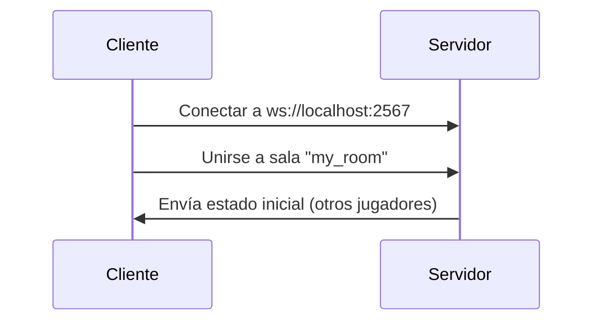
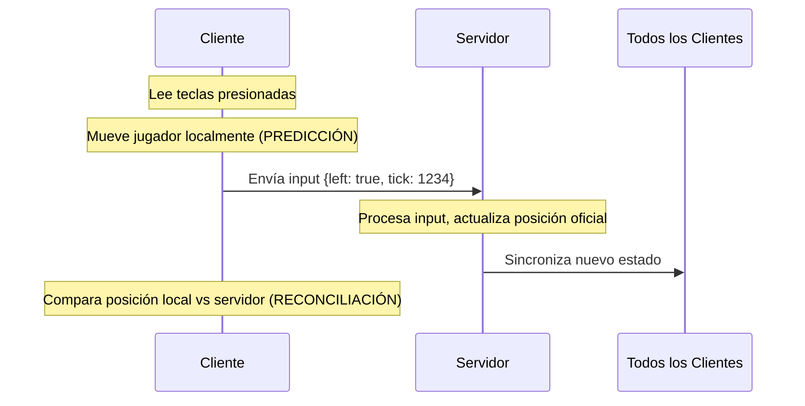
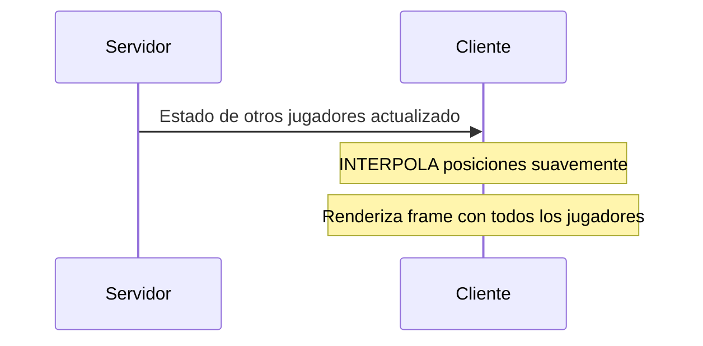

# 🎮 Fullstack RPG - Tutorial Completo para Principiantes

Un proyecto de juego multijugador en tiempo real desarrollado con **Phaser 3** (cliente) y **Colyseus** (servidor). Este proyecto te permitirá aprender los fundamentos del desarrollo de juegos web y sistemas multijugador.

## 📖 ¿Qué es este proyecto?

Este es un **juego RPG multijugador** donde los jugadores pueden moverse en tiempo real y ver a otros jugadores conectados. Implementa:

- ✅ **Sistema de escenas** con flujo de juego completo
- ✅ **Multijugador en tiempo real** con sincronización de estados
- ✅ **Predicción del lado del cliente** para movimiento fluido
- ✅ **Interpolación** de posiciones de otros jugadores
- ✅ **Sistema de ticks fijos** para consistencia en el servidor
- ✅ **Usernames personalizados** que aparecen arriba de cada jugador
- ✅ **Selección aleatoria de naves** de 23 diseños disponibles
- ✅ **Doble sistema de controles** - Flechas del teclado y teclas WASD
- ✅ **Soporte masivo** para hasta 100 jugadores simultáneos

## 🚀 Instalación Rápida

### Prerrequisitos

- Node.js 16+ instalado
- Un editor de código (VS Code recomendado)

### Configuración del Proyecto

1. **Clona o descarga el proyecto**
2. **Instalar dependencias del backend:**

   ```bash
   cd backend
   npm install
   ```

3. **Instalar dependencias del frontend:**
   ```bash
   cd ../frontend
   npm install
   ```

### Ejecutar el Proyecto

1. **Iniciar el servidor (backend):**

   ```bash
   cd backend
   npm run dev
   ```

   ✅ El servidor estará en `http://localhost:2567`

2. **Iniciar el cliente (frontend):**

   ```bash
   cd frontend
   npm run dev
   ```

   ✅ El juego estará en `http://localhost:8080`

3. **¡Jugar!**
   - Abre múltiples pestañas del navegador para ver el multijugador
   - **Se te pedirá un nombre de usuario** al entrar al juego
   - **Se te asignará una nave aleatoria** de las 23 disponibles
   - **Controles disponibles:**
     - **Flechas del teclado**: ↑ ↓ ← → para moverse
     - **Teclas WASD**: W (arriba), A (izquierda), S (abajo), D (derecha)
   - **Hasta 100 jugadores** pueden jugar simultáneamente
   - ¡Verás tu nombre y el de otros jugadores arriba de las naves!

## 🎯 ¿Qué es Phaser 3?

**Phaser** es un framework de JavaScript para crear juegos 2D que funcionan en navegadores web. Es como el "motor" que maneja gráficos, sonido, física y entrada del usuario.

### Conceptos Fundamentales de Phaser

#### 1. El Game Object (Objeto Juego)

```typescript
// frontend/src/game/root.ts - Configuración principal
const config: Phaser.Types.Core.GameConfig = {
  type: AUTO, // Usa WebGL o Canvas automáticamente
  width: 800, // Ancho del juego en píxeles
  height: 600, // Alto del juego en píxeles
  parent: "game-container", // Elemento HTML donde se renderiza
  backgroundColor: "#028af8", // Color de fondo
  physics: {
    default: "arcade", // Sistema de física arcade (simple)
  },
  pixelArt: true, // Optimizado para gráficos pixelados
  scene: [Boot, Preloader, MainMenu, MainGame, GameOver], // Lista de escenas
};
```

#### 2. Escenas (Scenes) - Los "Estados" del Juego

Las escenas son como diferentes pantallas o estados de tu juego:

##### 🔧 Boot Scene (`frontend/src/game/scenes/Boot.ts`)

**Propósito:** Primera escena que se ejecuta, carga recursos mínimos

```typescript
export class Boot extends Scene {
  preload() {
    // Carga solo recursos esenciales (fondos, logos)
    this.load.image("background", "assets/bg.png");
  }

  create() {
    // Inmediatamente cambia a Preloader
    this.scene.start("Preloader");
  }
}
```

##### ⏳ Preloader Scene (`frontend/src/game/scenes/Preloader.ts`)

**Propósito:** Muestra progreso de carga y carga todos los assets del juego

```typescript
export class Preloader extends Scene {
  init() {
    // Muestra fondo y crea barra de progreso visual
    this.add.image(512, 384, "background");
    const bar = this.add.rectangle(512 - 230, 384, 4, 28, 0xffffff);

    // Actualiza barra cuando cargan assets
    this.load.on("progress", (progress: number) => {
      bar.width = 4 + 460 * progress;
    });
  }

  preload() {
    // Carga todos los assets del juego
    this.load.image("logo", "logo.png");
    this.load.image("ship_0001", "ship_0001.png");
  }
}
```

##### 🎮 Main Menu Scene (`frontend/src/game/scenes/MainMenu.ts`)

**Propósito:** Menú principal con logo y texto

```typescript
export class MainMenu extends Scene {
  create() {
    // Muestra logo y título
    this.add.image(512, 300, "logo");
    this.add
      .text(512, 460, "Main Menu", {
        fontFamily: "Arial Black",
        fontSize: 38,
        color: "#ffffff",
      })
      .setOrigin(0.5);

    // Al hacer clic, inicia el juego
    this.input.once("pointerdown", () => {
      this.scene.start("Game");
    });
  }
}
```

##### 🎯 Game Scene (`frontend/src/game/scenes/Game.ts`) - ¡El Corazón!

**Propósito:** Escena principal donde ocurre toda la jugabilidad multijugador

**Métodos Principales:**

```typescript
export class Game extends Scene {
  async create() {
    // 1. Configurar controles
    this.cursorKeys = this.input.keyboard.createCursorKeys();

    // 2. Conectar al servidor Colyseus
    await this.connect();

    // 3. Configurar callbacks para jugadores
    this.room.state.players.onAdd((player, sessionId) => {
      // Crear sprite cuando un jugador se une
      const entity = this.physics.add.image(player.x, player.y, "ship_0001");
      this.playerEntities[sessionId] = entity;
    });
  }

  update(time: number, delta: number) {
    // Se ejecuta cada frame (60 veces por segundo)
    // Maneja el loop de juego con tiempo fijo
    this.elapsedTime += delta;
    while (this.elapsedTime >= this.fixedTimeStep) {
      this.elapsedTime -= this.fixedTimeStep;
      this.fixedTick(time, this.fixedTimeStep);
    }
  }

  fixedTick() {
    // Procesa entrada del usuario
    // Mueve jugador localmente (predicción)
    // Envía input al servidor
    // Interpola otros jugadores
  }
}
```

## 🌐 ¿Qué es Colyseus?

**Colyseus** es un framework de servidor para crear juegos multijugador en tiempo real. Maneja la comunicación entre múltiples clientes y sincroniza el estado del juego.

### Arquitectura del Servidor

#### 1. Punto de Entrada (`backend/src/index.ts`)

```typescript
// Importa configuración y inicia servidor
import { listen } from "@colyseus/tools";
import app from "./app.config";

listen(app); // Escucha en puerto 2567
```

#### 2. Configuración del Servidor (`backend/src/app.config.ts`)

```typescript
export default config({
  initializeGameServer: (gameServer) => {
    // Registra tipos de salas disponibles
    gameServer.define("my_room", MyRoom);
  },

  initializeExpress: (app) => {
    // Configura rutas HTTP adicionales
    app.get("/hello_world", (req, res) => {
      res.send("It's time to kick ass and chew bubblegum!");
    });

    // Panel de monitoreo en /monitor
    app.use("/monitor", monitor());
  },
});
```

#### 3. La Sala de Juego (`backend/src/rooms/MyRoom.ts`) - ¡El Cerebro!

Una **Room** es donde ocurre toda la lógica del juego multijugador:

```typescript
export class MyRoom extends Room<MyRoomState> {
  maxClients = 4; // Máximo 4 jugadores por sala
  fixedTimeStep = 1000 / 60; // 60 ticks por segundo

  onCreate(options: any) {
    // Configuración inicial
    this.state.mapWidth = 800;
    this.state.mapHeight = 600;

    // Escucha mensajes del cliente (mensaje tipo 0 = movimiento)
    this.onMessage(0, (client, input) => {
      const player = this.state.players.get(client.sessionId);
      player.inputQueue.push(input); // Agrega a cola de entrada
    });

    // Simulación de servidor a ticks fijos
    this.setSimulationInterval((deltaTime) => {
      // Procesa todos los inputs pendientes
      this.fixedTick(this.fixedTimeStep);
    });
  }

  fixedTick(timeStep: number) {
    const velocity = 2;

    this.state.players.forEach((player) => {
      let input: InputData;

      // Procesa todos los inputs en cola
      while ((input = player.inputQueue.shift())) {
        if (input.left) player.x -= velocity;
        if (input.right) player.x += velocity;
        if (input.up) player.y -= velocity;
        if (input.down) player.y += velocity;

        player.tick = input.tick; // Sincroniza tick
      }
    });
  }

  onJoin(client: Client, options: any) {
    // Se ejecuta cuando un jugador se conecta
    const player = new Player();
    player.x = Math.random() * this.state.mapWidth; // Posición aleatoria
    player.y = Math.random() * this.state.mapHeight;

    this.state.players.set(client.sessionId, player);
  }

  onLeave(client: Client, consented: boolean) {
    // Se ejecuta cuando un jugador se desconecta
    this.state.players.delete(client.sessionId);
  }
}
```

#### 4. Estado del Juego (`backend/src/rooms/schema/MyRoomState.ts`)

El **Estado** es lo que se sincroniza entre servidor y todos los clientes:

```typescript
export class Player extends Schema {
  @type("number") x: number; // Posición X
  @type("number") y: number; // Posición Y
  @type("number") tick: number; // Tick actual para sincronización
  inputQueue: InputData[] = []; // Cola de inputs (no se sincroniza)
}

export class MyRoomState extends Schema {
  @type("number") mapWidth: number; // Ancho del mapa
  @type("number") mapHeight: number; // Alto del mapa
  @type({ map: Player }) players = new MapSchema<Player>(); // Todos los jugadores
}

export interface InputData {
  left: boolean; // ¿Presionando izquierda?
  right: boolean; // ¿Presionando derecha?
  up: boolean; // ¿Presionando arriba?
  down: boolean; // ¿Presionando abajo?
  tick: number; // Tick del cliente cuando envió input
}
```

## 🔄 Flujo de Comunicación Cliente-Servidor

### 1. **Inicialización**



### 2. **Loop de Juego (cada frame)**



### 3. **Otros Jugadores**



## 🛠️ Técnicas Avanzadas Implementadas

### 1. **Predicción del Lado del Cliente**

```typescript
// En Game.ts - fixedTick()
// El cliente mueve al jugador INMEDIATAMENTE
if (this.inputPayload.left) {
  this.currentPlayer.x -= velocity; // ⚡ Respuesta inmediata
}
// Luego envía el input al servidor
this.room.send(0, this.inputPayload);
```

### 2. **Interpolación de Otros Jugadores**

```typescript
// En Game.ts - fixedTick()
for (let sessionId in this.playerEntities) {
  if (sessionId === this.room.sessionId) continue; // Saltar jugador local

  const entity = this.playerEntities[sessionId];
  const { serverX, serverY } = entity.data.values;

  // Mueve suavemente hacia la posición del servidor
  entity.x = Phaser.Math.Linear(entity.x, serverX, 0.2); // 🌊 Interpolación suave
  entity.y = Phaser.Math.Linear(entity.y, serverY, 0.2);
}
```

### 3. **Sistema de Ticks Fijos**

```typescript
// Tanto cliente como servidor usan tiempo fijo
const fixedTimeStep = 1000 / 60; // 60 FPS

update(time: number, delta: number) {
  this.elapsedTime += delta;
  while (this.elapsedTime >= this.fixedTimeStep) {
    this.elapsedTime -= this.fixedTimeStep;
    this.fixedTick(); // ⏰ Lógica a tiempo fijo
  }
}
```

## ⏰ ¿Qué son los Ticks? - Explicación para Principiantes

Los **ticks** son uno de los conceptos más importantes en el desarrollo de juegos multijugador. Te explico de forma sencilla:

### 🎯 ¿Qué es un Tick?

Un **tick** es como el "latido del corazón" del juego. Es una unidad de tiempo fija en la que el servidor (y cliente) actualizan la lógica del juego.

#### Analogía Simple

Imagínate que el juego es como una película:

- Una **película** tiene 24 fotogramas por segundo
- Un **juego** tiene 60 **ticks** por segundo

En cada tick, el servidor:

1. ✅ Procesa los inputs de todos los jugadores
2. ✅ Actualiza posiciones de personajes
3. ✅ Calcula colisiones
4. ✅ Envía el estado actualizado a todos los clientes

### 🕐 Tiempo Fijo vs Tiempo Variable

#### ❌ Problema sin Ticks Fijos

```typescript
// MAL: Basado en tiempo real (variable)
update(deltaTime) {
    player.x += speed * deltaTime; // ¡Inconsistente!
}
```

**Problema:** Si el juego va lento, el jugador se mueve menos. Si va rápido, se mueve más.

#### ✅ Solución con Ticks Fijos

```typescript
// BIEN: Tiempo fijo
const TICK_RATE = 1000 / 60; // 60 ticks por segundo = 16.67ms por tick

fixedTick() {
    player.x += speed; // ¡Siempre la misma velocidad!
}
```

### 🔄 Cómo Funcionan en tu Proyecto

#### En el Servidor (`MyRoom.ts`)

```typescript
export class MyRoom extends Room<MyRoomState> {
  fixedTimeStep = 1000 / 60; // 60 ticks por segundo

  onCreate() {
    // Configura el tick fijo del servidor
    this.setSimulationInterval((deltaTime) => {
      this.fixedTick(this.fixedTimeStep);
    });
  }

  fixedTick(timeStep: number) {
    // Procesa TODOS los inputs pendientes
    this.state.players.forEach((player) => {
      let input: InputData;

      while ((input = player.inputQueue.shift())) {
        if (input.left) player.x -= 2;
        if (input.right) player.x += 2;

        player.tick = input.tick; // ⭐ Sincroniza el número de tick
      }
    });
  }
}
```

#### En el Cliente (`Game.ts`)

```typescript
export class Game extends Scene {
  private elapsedTime = 0;
  private fixedTimeStep = 1000 / 60; // Mismo tick rate que servidor
  private currentTick = 0;

  update(time: number, delta: number) {
    this.elapsedTime += delta;

    // Ejecuta ticks fijos aunque el framerate sea variable
    while (this.elapsedTime >= this.fixedTimeStep) {
      this.elapsedTime -= this.fixedTimeStep;
      this.currentTick++; // ⭐ Incrementa contador de tick
      this.fixedTick();
    }
  }

  fixedTick() {
    // Lee input y lo marca con el tick actual
    this.inputPayload = {
      left: this.cursorKeys.left.isDown,
      right: this.cursorKeys.right.isDown,
      tick: this.currentTick, // ⭐ Número de tick cuando se envió
    };

    // Envía al servidor
    this.room.send(0, this.inputPayload);
  }
}
```

### 🎭 Los Ticks Resuelven Problemas Importantes

#### 1. **Sincronización**

```typescript
// El cliente envía: { left: true, tick: 1205 }
// El servidor procesa exactamente en el tick 1205
// ✅ Todos los jugadores ven lo mismo al mismo tiempo
```

#### 2. **Predicción del Cliente**

```typescript
// Cliente predice inmediatamente
if (input.left) {
  this.currentPlayer.x -= 2; // ⚡ Respuesta instantánea
}

// Servidor confirma más tarde
// Si hay diferencia, el cliente se corrige suavemente
```

#### 3. **Reconciliación**

```typescript
// Cliente compara su predicción vs respuesta del servidor
if (Math.abs(localPlayer.x - serverPlayer.x) > 5) {
  // Ajustar posición gradualmente
  localPlayer.x = Phaser.Math.Linear(localPlayer.x, serverPlayer.x, 0.1);
}
```

### 📊 Ejemplo Visual de Ticks

```
Tick 1200: Jugador en X=100, presiona →
Tick 1201: Jugador en X=102, presiona →
Tick 1202: Jugador en X=104, presiona →
Tick 1203: Jugador en X=106, suelta →
Tick 1204: Jugador en X=106, sin input
```

### ⚙️ Configuraciones Comunes

#### Tick Rates Típicos

```typescript
// Juegos de acción rápida (shooters)
const TICK_RATE = 1000 / 128; // 128 ticks/segundo

// Juegos normales (la mayoría)
const TICK_RATE = 1000 / 60; // 60 ticks/segundo

// Juegos más lentos (estrategia)
const TICK_RATE = 1000 / 20; // 20 ticks/segundo
```

#### En tu `MyRoomState.ts`

```typescript
export interface InputData {
  left: boolean;
  right: boolean;
  up: boolean;
  down: boolean;
  tick: number; // ⭐ El número de tick es CRUCIAL
}

export class Player extends Schema {
  @type("number") x: number;
  @type("number") y: number;
  @type("number") tick: number; // ⭐ Último tick procesado del jugador

  inputQueue: InputData[] = []; // Cola de inputs pendientes
}
```

### 🚀 ¿Por Qué es Tan Importante?

#### Sin Ticks Fijos:

- ❌ Jugadores con mejor computadora se mueven más rápido
- ❌ Lag hace que el juego se vuelva impredecible
- ❌ Imposible sincronizar múltiples jugadores
- ❌ Cheating más fácil

#### Con Ticks Fijos:

- ✅ Todos los jugadores van a la misma velocidad
- ✅ El juego es determinístico y reproducible
- ✅ Sincronización perfecta entre clientes
- ✅ Detección de cheating más fácil

### 💡 Tips para Principiantes

1. **Tick = Paso de tiempo fijo** (ej: cada 16.67ms)
2. **Número de tick = Contador** que se incrementa cada paso
3. **Input con tick** permite saber "cuándo" se presionó una tecla
4. **Servidor autoritativo** usa ticks para validar todo
5. **Cliente predice** pero servidor tiene la palabra final

¡Los ticks son la base de todo juego multijugador serio! 🎮✨

## 🎓 Tutorial: Crear tu Primera Función

### Ejemplo 1: Agregar Sistema de Chat

**1. Añadir al estado (Backend):**

```typescript
// MyRoomState.ts
export class ChatMessage extends Schema {
  @type("string") text: string;
  @type("string") author: string;
}

export class MyRoomState extends Schema {
  // ... código existente ...
  @type([ChatMessage]) messages = new ArraySchema<ChatMessage>();
}
```

**2. Manejar mensajes (Backend):**

```typescript
// MyRoom.ts - dentro de onCreate()
this.onMessage("chat", (client, data) => {
  const message = new ChatMessage();
  message.text = data.text;
  message.author = client.sessionId;
  this.state.messages.push(message);
});
```

**3. Enviar desde cliente (Frontend):**

```typescript
// Game.ts - dentro de create()
this.input.keyboard.on("keydown-ENTER", () => {
  const text = prompt("Escribe tu mensaje:");
  if (text) {
    this.room.send("chat", { text });
  }
});
```

### Ejemplo 2: Sistema de Salud

**1. Añadir al jugador:**

```typescript
// MyRoomState.ts
export class Player extends Schema {
  // ... código existente ...
  @type("number") health: number = 100;
}
```

**2. Mostrar en cliente:**

```typescript
// Game.ts - dentro de create()
$(this.room.state).players.onAdd((player, sessionId) => {
  const entity = this.physics.add.image(player.x, player.y, player.shipType);

  // Crear barra de salud
  const healthBar = this.add.rectangle(
    player.x,
    player.y - 20,
    50,
    5,
    0x00ff00
  );

  $(player).onChange(() => {
    // Actualizar barra según salud actual
    healthBar.width = (player.health / 100) * 50;
    healthBar.fillColor = player.health > 50 ? 0x00ff00 : 0xff0000;
  });
});
```

## 🎮 Funcionalidades Implementadas en el Proyecto

### 🏷️ Sistema de Usernames

Cada jugador puede personalizar su nombre al entrar al juego:

#### En el Servidor (`MyRoomState.ts`):

```typescript
export class Player extends Schema {
  @type("number") x: number;
  @type("number") y: number;
  @type("number") tick: number;
  @type("string") username: string = "Player"; // 🆕 Username del jugador
  @type("string") shipType: string = "ship_0001"; // 🆕 Tipo de nave
  inputQueue: InputData[] = [];
}
```

#### En el Cliente (`Game.ts`):

```typescript
async connect() {
  // Solicitar username al usuario
  let username = prompt("¡Bienvenido al juego!\n\nIngresa tu nombre de usuario:");

  // Validar y limpiar username
  if (!username || username.trim() === "") {
    username = `Player_${Math.floor(Math.random() * 1000)}`;
  }
  username = username.trim().substring(0, 12); // Máximo 12 caracteres

  // Enviar username al servidor
  this.room = await client.joinOrCreate("my_room", { username });
}
```

### 🚀 Sistema de Naves Aleatorias

Cada jugador recibe una nave única aleatoriamente seleccionada:

#### Pool de Naves Disponibles:

```typescript
// MyRoom.ts - 23 naves diferentes
const shipTypes = [
  "ship_0001",
  "ship_0002",
  "ship_0003",
  "ship_0004",
  "ship_0005",
  "ship_0006",
  "ship_0007",
  "ship_0008",
  "ship_0009",
  "ship_0010",
  "ship_0011",
  "ship_0012",
  "ship_0013",
  "ship_0014",
  "ship_0015",
  "ship_0016",
  "ship_0017",
  "ship_0018",
  "ship_0019",
  "ship_0020",
  "ship_0021",
  "ship_0022",
  "ship_0023",
];

// Selección aleatoria
player.shipType = shipTypes[Math.floor(Math.random() * shipTypes.length)];
```

#### Carga de Assets (`Preloader.ts`):

```typescript
preload() {
  // Cargar todas las naves disponibles automáticamente
  for (let i = 1; i <= 23; i++) {
    const shipNumber = i.toString().padStart(4, '0');
    this.load.image(`ship_${shipNumber}`, `ship_${shipNumber}.png`);
  }
}
```

### 📝 Visualización de Usernames

Los nombres aparecen flotando arriba de cada nave:

```typescript
// Game.ts - Crear username text
$(this.room.state).players.onAdd((player, sessionId) => {
  // Crear sprite con la nave específica
  const entity = this.physics.add.image(player.x, player.y, player.shipType);

  // Crear texto del username arriba del jugador
  const usernameText = this.add
    .text(player.x, player.y - 30, player.username, {
      fontSize: "12px",
      color: "#ffffff",
      stroke: "#000000",
      strokeThickness: 2,
      align: "center",
    })
    .setOrigin(0.5);

  this.playerUsernames[sessionId] = usernameText;
});
```

### 🔄 Sincronización de Posiciones

Los usernames siguen a los jugadores automáticamente:

```typescript
// Game.ts - En fixedTick()
for (let sessionId in this.playerEntities) {
  const entity = this.playerEntities[sessionId];
  const usernameText = this.playerUsernames[sessionId];

  // Interpolar posición de nave
  entity.x = Phaser.Math.Linear(entity.x, serverX, 0.2);
  entity.y = Phaser.Math.Linear(entity.y, serverY, 0.2);

  // Mover username siguiendo a la nave
  if (usernameText) {
    usernameText.x = entity.x;
    usernameText.y = entity.y - 30; // 30 píxeles arriba de la nave
  }
}
```

### 🎨 Estilos del Username

- **Color:** Blanco (`#ffffff`)
- **Borde:** Negro con grosor de 2px para mejor legibilidad
- **Tamaño:** 12px
- **Posición:** 30 píxeles arriba de la nave
- **Alineación:** Centrado
- **Límite:** Máximo 12 caracteres

### 🎮 Sistema de Controles Duales

Los jugadores pueden usar dos sistemas de control diferentes para mayor comodidad:

#### Controles Implementados:

```typescript
// Game.ts - Configuración de controles
async create() {
  // Controles con flechas del teclado (tradicional)
  this.cursorKeys = this.input!.keyboard!.createCursorKeys();

  // Controles WASD (para gamers de PC)
  this.wasdKeys = {
    W: this.input!.keyboard!.addKey(Phaser.Input.Keyboard.KeyCodes.W),
    A: this.input!.keyboard!.addKey(Phaser.Input.Keyboard.KeyCodes.A),
    S: this.input!.keyboard!.addKey(Phaser.Input.Keyboard.KeyCodes.S),
    D: this.input!.keyboard!.addKey(Phaser.Input.Keyboard.KeyCodes.D),
  };
}
```

#### Lógica de Input Combinada:

```typescript
// Game.ts - En fixedTick()
fixedTick() {
  // Combinar ambos sistemas de control con OR lógico
  this.inputPayload.left = this.cursorKeys.left.isDown || this.wasdKeys.A.isDown;
  this.inputPayload.right = this.cursorKeys.right.isDown || this.wasdKeys.D.isDown;
  this.inputPayload.up = this.cursorKeys.up.isDown || this.wasdKeys.W.isDown;
  this.inputPayload.down = this.cursorKeys.down.isDown || this.wasdKeys.S.isDown;

  // El resto de la lógica permanece igual
  this.room.send(0, this.inputPayload);
}
```

#### Mapeo de Controles:

| Acción        | Flechas | WASD |
| ------------- | ------- | ---- |
| **Arriba**    | ↑       | W    |
| **Abajo**     | ↓       | S    |
| **Izquierda** | ←       | A    |
| **Derecha**   | →       | D    |

#### Ventajas del Sistema Dual:

- ✅ **Flexibilidad:** Los jugadores eligen su preferencia
- ✅ **Accesibilidad:** Funciona para diferentes tipos de teclados
- ✅ **Familiaridad:** WASD es estándar en juegos de PC
- ✅ **Sin conflictos:** Ambos sistemas pueden usarse simultáneamente

### 🏟️ Sistema de Sala Masiva

El servidor ahora soporta hasta **100 jugadores simultáneos**:

```typescript
// MyRoom.ts - Configuración del servidor
export class MyRoom extends Room<MyRoomState> {
  maxClients = 100; // ⬆️ Aumentado de 4 a 100 jugadores

  // El resto de la lógica escala automáticamente
  // Colyseus maneja eficientemente la sincronización
}
```

#### Beneficios de 100 Jugadores:

- 🎊 **Experiencia masiva:** Batallas épicas y eventos grandes
- ⚡ **Eficiencia:** Colyseus optimiza automáticamente la red
- 🔧 **Escalabilidad:** Fácil ajustar según necesidades del servidor
- 🎯 **Testing:** Ideal para pruebas de carga y stress testing

## 📁 Estructura de Archivos Explicada

```
fullstack-rpg/
├── frontend/                          # 🎮 CLIENTE (Phaser 3)
│   ├── src/
│   │   ├── main.ts                   # 🚀 Punto de entrada, inicia el juego
│   │   └── game/
│   │       ├── root.ts               # ⚙️ Configuración principal de Phaser
│   │       └── scenes/               # 🎬 Todas las escenas del juego
│   │           ├── Boot.ts           # 🔧 Carga recursos básicos
│   │           ├── Preloader.ts      # ⏳ Carga assets + barra progreso
│   │           ├── MainMenu.ts       # 📋 Menú principal
│   │           ├── Game.ts           # 🎯 Juego multijugador principal
│   │           └── GameOver.ts       # 💀 Pantalla de fin de juego
│   ├── public/
│   │   ├── assets/                   # 🖼️ Imágenes, sonidos, etc.
│   │   └── style.css                 # 🎨 Estilos CSS
│   ├── index.html                    # 🌐 HTML principal
│   ├── package.json                  # 📦 Dependencias del frontend
│   └── vite/                         # ⚡ Configuración Vite (bundler)
├── backend/                          # 🖥️ SERVIDOR (Colyseus)
│   ├── src/
│   │   ├── index.ts                  # 🚀 Punto de entrada del servidor
│   │   ├── app.config.ts             # ⚙️ Configuración servidor y rutas
│   │   └── rooms/                    # 🏠 Lógica de salas multijugador
│   │       ├── MyRoom.ts             # 🧠 Sala principal, lógica del juego
│   │       └── schema/               # 📋 Definición de estados
│   │           └── MyRoomState.ts    # 🔄 Estado sincronizado jugadores
│   ├── package.json                  # 📦 Dependencias del backend
│   └── loadtest/                     # 🧪 Pruebas de carga
└── README.md                         # 📖 Esta documentación
```

## 🔧 Comandos de Desarrollo

### Frontend

```bash
npm run dev          # 🚀 Servidor desarrollo (localhost:8080)
npm run build        # 📦 Compilar para producción
```

### Backend

```bash
npm run dev          # 🚀 Servidor desarrollo con recarga automática
npm run build        # 📦 Compilar TypeScript
npm run loadtest     # 🧪 Prueba con 2 clientes simulados
```

### URLs Útiles

- **Juego:** http://localhost:8080
- **Monitor Colyseus:** http://localhost:2567/monitor
- **Playground:** http://localhost:2567

## 🐛 Debugging y Resolución de Problemas

### Problema: "No se puede conectar al servidor"

```javascript
// Revisar en Game.ts que la URL sea correcta
const BACKEND_URL = "ws://localhost:2567"; // ✅ Debe coincidir con puerto backend
```

### Problema: "Los jugadores no se mueven suavemente"

```typescript
// Ajustar velocidad de interpolación en Game.ts
entity.x = Phaser.Math.Linear(entity.x, serverX, 0.1); // 🐌 Más suave
entity.x = Phaser.Math.Linear(entity.x, serverX, 0.5); // 🏃‍♂️ Más rápido
```

### Problema: "FPS bajos"

```typescript
// En root.ts, ajustar configuración de rendimiento
const config = {
  // ... otras opciones ...
  render: {
    pixelArt: true, // ✅ Mejor rendimiento para pixel art
    antialias: false, // ✅ Desactivar antialiasing
    roundPixels: true, // ✅ Redondear píxeles
  },
};
```

## 🚀 Próximos Pasos para Aprender Más

### Nivel Básico

1. **Añadir más sprites:** Cambiar nave por otros personajes
2. **Animaciones:** Crear animaciones de caminar para jugadores
3. **Sonidos:** Agregar efectos de sonido y música
4. **UI:** Crear interfaz con botones y menús

### Nivel Intermedio

1. **Sistema de chat:** Comunicación entre jugadores
2. **Diferentes salas:** Múltiples niveles o mapas
3. **Física avanzada:** Colisiones con obstáculos
4. **Sistema de inventario:** Items y equipamiento

### Nivel Avanzado

1. **Base de datos:** Guardar progreso de jugadores
2. **Autenticación:** Sistema de login y usuarios
3. **Balanceador de carga:** Múltiples servidores
4. **Modo producción:** Despliegue en la nube

## 📚 Recursos para Seguir Aprendiendo

### Documentación Oficial

- 📖 [Phaser 3 Docs](https://photonstorm.github.io/phaser3-docs/)
- 📖 [Colyseus Docs](https://docs.colyseus.io/)

### Tutoriales Recomendados

- 🎥 [Phaser 3 Examples](https://phaser.io/examples) - Cientos de ejemplos
- 🎥 [Colyseus Examples](https://github.com/colyseus/colyseus-examples) - Proyectos de ejemplo

### Comunidades

- 💬 [Phaser Discord](https://discord.gg/phaser)
- 💬 [Colyseus Discord](https://discord.gg/RY8rRS7)
- 🐦 [Twitter - @photonstorm](https://twitter.com/photonstorm)

## 🤝 Contribuir al Proyecto

1. Haz fork del repositorio
2. Crea una rama: `git checkout -b mi-nueva-funcionalidad`
3. Haz tus cambios y committea: `git commit -am 'Agregué nueva funcionalidad'`
4. Push: `git push origin mi-nueva-funcionalidad`
5. Crea un Pull Request

---

### 💡 Tips Finales para Principiantes

1. **Empieza pequeño:** Modifica valores como velocidad o colores antes de añadir funcionalidades
2. **Usa console.log():** Imprime valores para entender qué está pasando
3. **Experimenta:** Cambia números, colores y textos para ver qué sucede
4. **Lee errores:** Los mensajes de error te dicen exactamente qué está mal
5. **Pregunta:** Las comunidades de gamedev son muy colaborativas

¡Diviértete creando tu primer juego multijugador! 🎮✨
